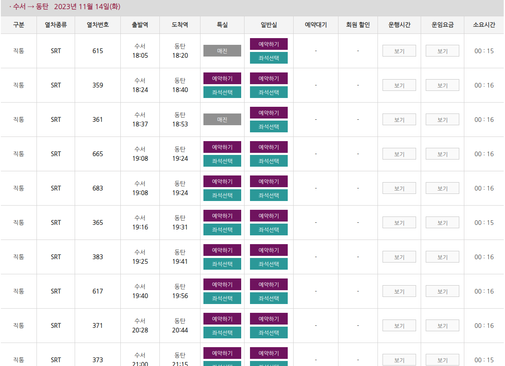

# Python program for booking SRT ticket.


매진된 SRT 표의 예매를 도와주는 파이썬 프로그램입니다.  
원하는 표가 나올 때 까지 새로고침하여 예약을 시도합니다.


## 다운
```cmd
git clone https://github.com/kminito/srt_reservation.git
```
  
## 필요
- 파이썬 3.7, 3.9에서 테스트 했습니다.

```py
pip install -r requirements.txt
```

## 간단 사용법
just modify quickstart.py and run it.

```bash
$ python quickstart.py

```

회원번호 1234567890  
비밀번호 000000  
수서-> 동탄, 2023년 11월 14일 18시 이후 기차  
1,3,5번째 기차중 하나 (18:05, 18:37, 19:08)




**Optional**  
slack alarm
[link](https://getitall.tistory.com/entry/Python-%EC%8A%AC%EB%9E%99-Slack-%EB%A9%94%EC%8B%A0%EC%A0%80-%EB%B4%87-%EB%A7%8C%EB%93%A4%EA%B8%B0-%EC%BD%94%EB%93%9C-%ED%8F%AC%ED%95%A8-%EC%B4%88%EA%B0%84%EB%8B%A8-%EC%BD%94%EB%94%A9) 참고
slack bot 만들기
quickstart.py slack_token에 token 값 입력

## 기타  
명절 승차권 예약에는 사용이 불가합니다.  
